# Store ETL project — Data Vault 2.0 + ClickHouse + Airflow + SuperSet

## О проекте

Проект, имитирующий потоковую обработку данных интернет-магазина, включающий озеро данных (Data Lakehouse) с использованием **Data Vault 2.0** для хранения истории изменений, **ClickHouse** для логирования, аналитики и витрин данных, **Airflow** для оркестрации ETL и нагрузочных ботов, **FastAPI** для бэкенда и **Superset** для дашбордов.

### Ключевые особенности

- **Источник**: бэкенд на FastAPI, с бд на PostgreSQL и логированием в ClickHouse.
- **DWH**
  - **Staging**: PostgreSQL с партиционированием через `pg_partman`.
  - **Raw Vault**: PostgreSQL, реализация Data Vault 2.0 (хабы, линки, сателлиты).
  - **Data Mart**: ClickHouse, построены по схеме "Звезда".
  - **Info Mart**: ClickHouse, витрины данных.
- **Оркестрация**: Airflow DAG для:
  - Ботов (имитация действий пользователей).
  - Загрузки из бэкенда и логов в staging.
  - Перелива из staging в Raw Vault (инкрементально).
  - Построения витрин из Raw Vault в ClickHouse.
- **Визуализация**: Apache Superset (дашборды на основе Info Mart).

---

## Бэкенд

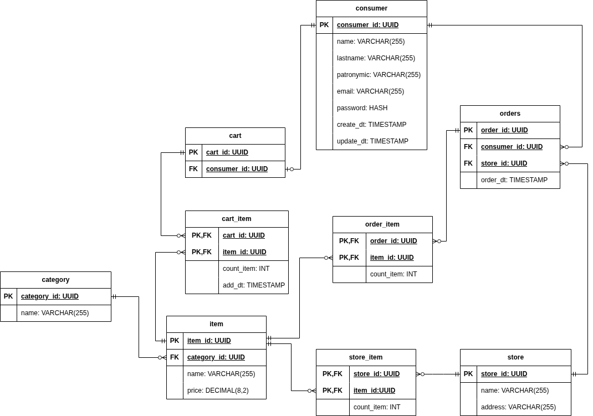

Бэкенд на **FastAPI** — генератор событий. 
Предоставляет REST API, логирует все действия в ClickHouse, данные отдаёт в Staging.
  Позволяет:
 - Создавать/удалять/изменять пользователей;
 - Добавлять предметы в корзину и удалять их;
 - Изменять количество предметов в корзине;
 - Создавать заказы;

### Стек
- **FastAPI** + **Uvicorn**
- **SQLAlchemy 2.0** (async, sync для генерации)
- **Pydantic** + **Pydantic Settings**
- **ClickHouse Connect** (асинхронная буферизация)
- **Faker** (генерация начальных данных)

---

## Логи

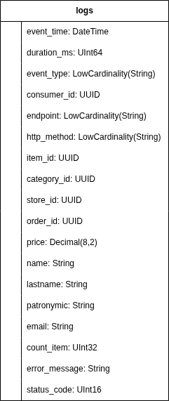

---

## DWH

### Staging

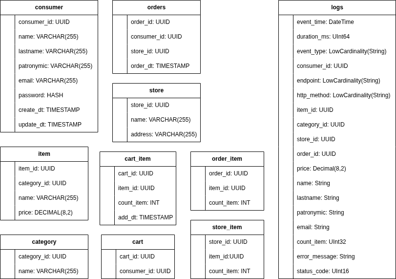

### Raw Vault

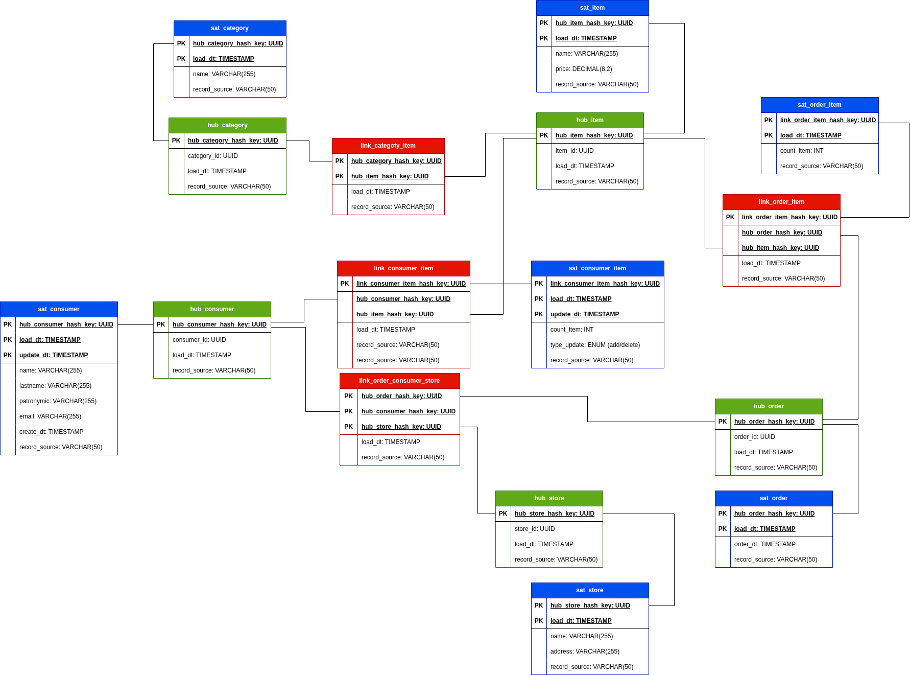

### Data Marts

**dm_common**

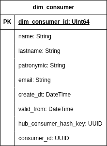

**dm_order_item**

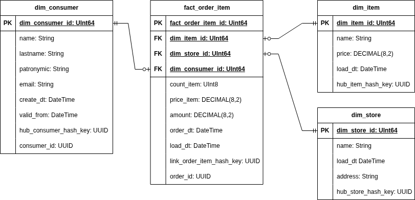

**dm_consumer_change**

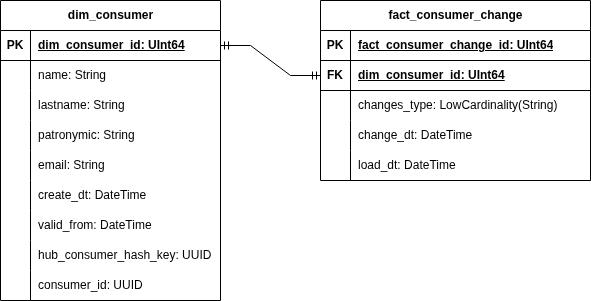

### Info Marts

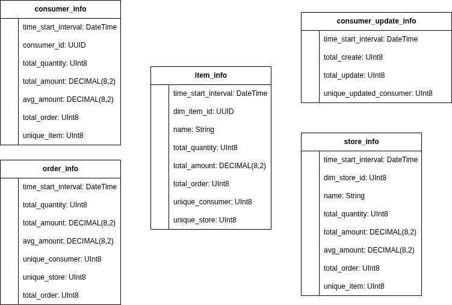

---

## ETL процессы

### Нагрузочные боты

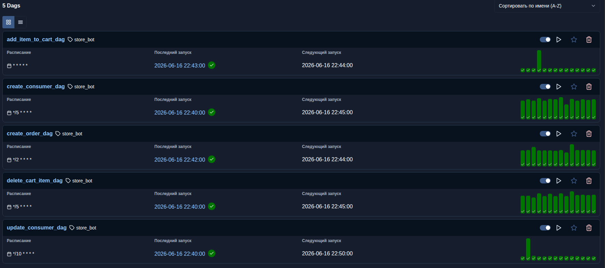

### На слой Staging

### На слой Raw Vault

### На слой Data Mart

### На слой Info Mart

---

## Дашборды

### Метрики магазинов

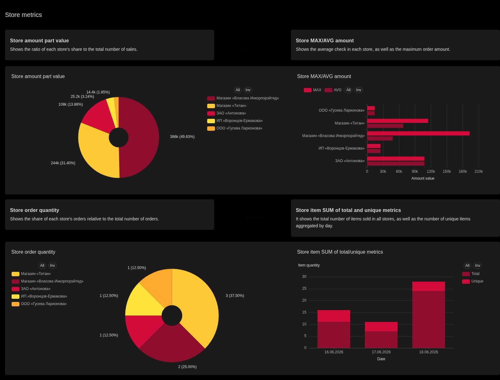

### Метрики товаров

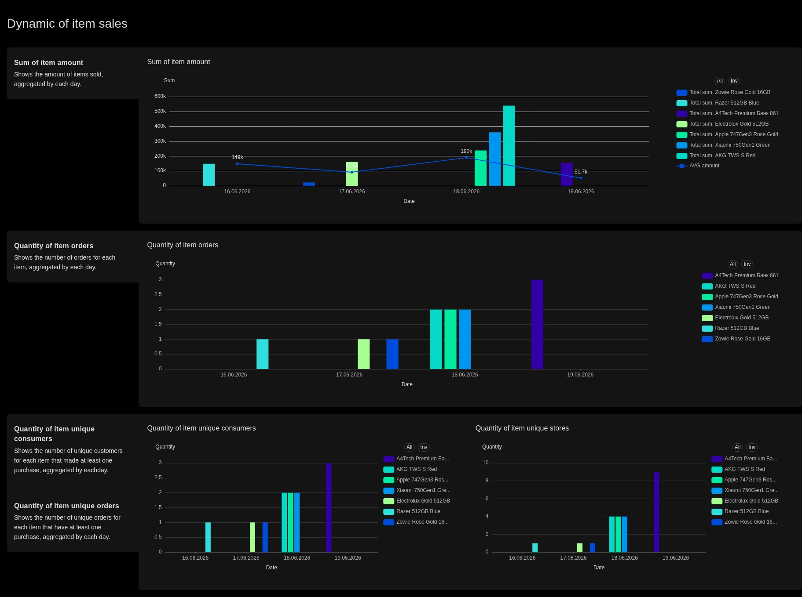

### Метрики заказов

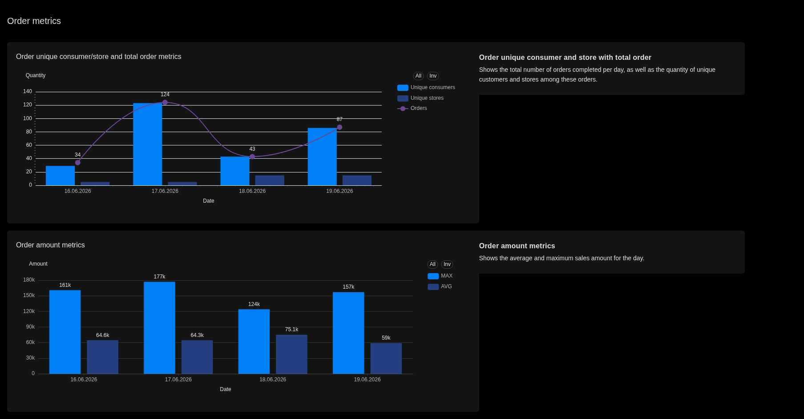

### Метрики покупателей

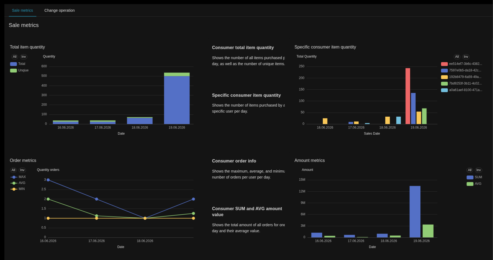
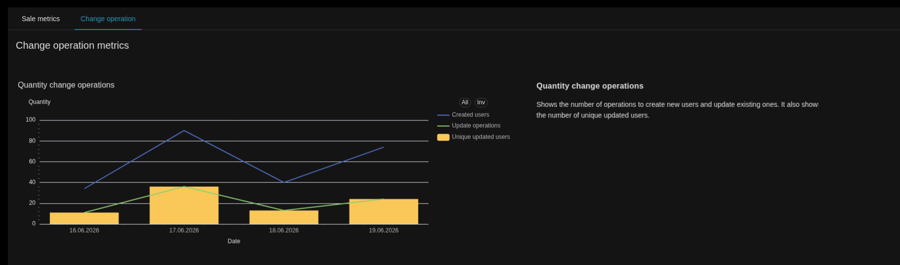

---

## Тестовый запуск

Для быстрого развёртывания всех компонентов проекта предусмотрен **Makefile**.  
Все команды используют переменные окружения из файла `.test.env`

### Доступные команды

| Компонент               | Запуск                     | Остановка                   | Остановка + удаление данных |
|-------------------------|----------------------------|-----------------------------|------------------------------|
| **Backend + ClickHouse (логи)** | `make up-backend`    | `make down-backend`         | `make down-backend-v`        |
| **DWH**    | `make up-dwh`        | `make down-dwh`             | `make down-dwh-v`            |
| **Airflow**             | `make up-airflow`    | `make down-airflow`         | `make down-airflow-v`        |
| **Superset**            | `make up-superset`   | `make down-superset`        | `make down-superset-v`       |
